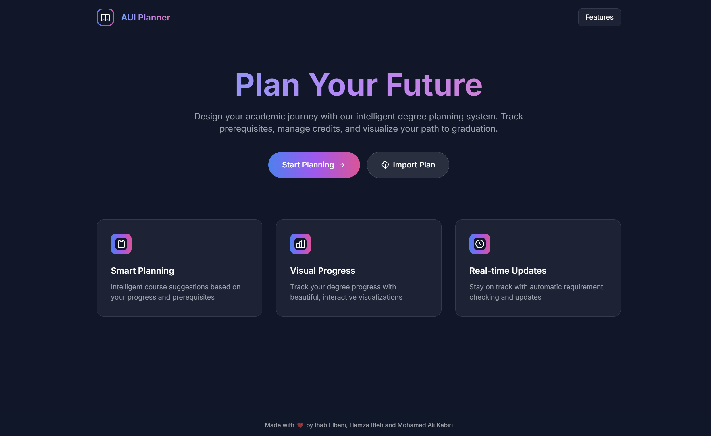

# AUI Track: Academic Degree Planner

A comprehensive, modern degree planning application designed to help university students map out their academic journey from enrollment to graduation.



## Project Overview

AUI Track is an advanced web application developed to streamline the academic planning process for university students. It provides a visually intuitive interface for planning courses across multiple semesters while ensuring adherence to prerequisite requirements, credit limits, and graduation timelines.

The application was created to address common challenges students face when planning their academic journey, including:
- Understanding complex prerequisite relationships between courses
- Balancing course loads across semesters
- Ensuring all graduation requirements are met
- Adapting plans when course offerings or personal circumstances change

## Creators

This project was developed by:

- **Ihab Elbani** - Lead Developer & UI/UX Designer
- **Mohamed Ali Kabiri** - Backend Developer & Data Integration Specialist
- **Hamza Ifleh** - Frontend Developer & Testing Coordinator

## Key Features

- **Personalized Academic Planning**: Customized degree plans based on student information, major, and timeline
- **Interactive Semester View**: Visually organize courses by semester with drag-and-drop functionality
- **Intelligent Prerequisite Validation**: Real-time validation of course prerequisites to prevent registration errors
- **Credit Management**: Automatic tracking of credits per semester with limits (22 for regular semesters, 10 for summer)
- **Progress Tracking**: Visual representation of progress toward degree completion
- **Course Filtering**: Smart filtering to show only courses with satisfied prerequisites
- **Exportable Plans**: Generate and download degree plans as formatted documents
- **Responsive Design**: Optimized for both desktop and mobile devices
- **User-Friendly Interface**: Modern, intuitive UI with smooth animations and visual feedback

## Technical Architecture

### Frontend
- **Framework**: Next.js 14 with App Router for server-side rendering and routing
- **UI Library**: React 18 with functional components and hooks
- **Styling**: Tailwind CSS for utility-first styling with custom animations
- **State Management**: Zustand for simplified global state management
- **Animations**: Framer Motion for fluid, physics-based animations
- **TypeScript**: For type safety, better developer experience, and code reliability

### Data Management
- **Course Data**: JSON-based course catalog with comprehensive metadata
- **State Persistence**: Local storage for saving and restoring user sessions
- **PDF Generation**: Custom document formatting for exportable degree plans

## Detailed Project Structure

```
/
├── public/                  # Static assets and images
├── src/
│   ├── app/                 # Next.js app router pages
│   │   ├── degree-plan/     # Main degree planning interface
│   │   ├── user-info/       # User information collection page
│   │   ├── planner/         # Course data loading page
│   │   └── page.tsx         # Home/landing page
│   ├── components/          # Reusable React components
│   │   ├── AddCourseModal/  # Modal for adding courses to semesters
│   │   ├── CourseNode/      # Individual course display component
│   │   ├── SemesterGroup/   # Container for courses in a semester
│   │   └── YearGroup/       # Container for semesters in an academic year
│   ├── data/                # Static data files
│   │   └── csMajor.ts       # Computer Science major requirements
│   ├── lib/                 # Utility functions and core logic
│   │   ├── pdfParser.ts     # PDF parsing for course data extraction
│   │   ├── store.ts         # Zustand store for global state management
│   │   └── degreePlanGenerator.ts # Logic for generating degree plans
│   └── types/               # TypeScript type definitions
└── jz_scraper_final.json    # Course catalog data
```

## Core Components

### User Flow
1. **Home Page**: Introduction and entry point to the application
2. **User Information**: Collection of student details, major, and timeline
3. **Degree Plan**: Interactive interface for planning courses by semester
4. **Course Selection**: Modal interface for searching and adding courses
5. **Plan Export**: Generation of formatted degree plan documents

### State Management
The application uses Zustand for state management with the following key state elements:
- **userInfo**: Student personal and academic information
- **courseData**: Comprehensive catalog of all available courses
- **semesterPlans**: Current course selections organized by semester
- **error**: System for tracking and displaying validation errors

### Prerequisites System
The application implements a sophisticated prerequisites validation system that:
1. Parses complex prerequisite relationships from course data
2. Validates prerequisites before allowing course enrollment
3. Supports both AND and OR logical conditions for prerequisites
4. Provides clear, actionable error messages when prerequisites are not met
5. Filters course selection to show only available courses by default

## Getting Started

### Prerequisites
- Node.js 18 or higher
- npm or yarn package manager

### Installation
1. Clone the repository:
   ```
   git clone https://github.com/IhabProjects/AuiTrack.git
   cd AuiTrack
   ```

2. Install dependencies:
   ```
   npm install
   # or
   yarn install
   ```

3. Run the development server:
   ```
   npm run dev
   # or
   yarn dev
   ```

4. Open [http://localhost:3000](http://localhost:3000) in your browser.

## Deployment
The application is optimized for deployment on Vercel:

```
npm run build
npm run start
```

## Future Enhancements
- **Course Conflict Detection**: Identify scheduling conflicts between selected courses
- **Graduation Audit**: Comprehensive verification of all graduation requirements
- **Academic Calendar Integration**: Sync with university academic calendars
- **Advisor Collaboration**: Tools for sharing plans with academic advisors
- **Mobile Application**: Native mobile experience for on-the-go planning
- **Machine Learning Recommendations**: Smart course suggestions based on student goals and performance

## License
MIT

## Acknowledgements
- Al Akhawayn University for course data and academic requirements
- [Tailwind CSS](https://tailwindcss.com/)
- [Framer Motion](https://www.framer.com/motion/)
- [Next.js](https://nextjs.org/)
- [Zustand](https://github.com/pmndrs/zustand)
